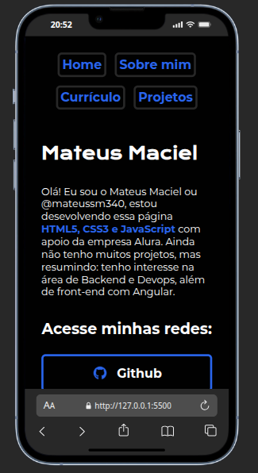
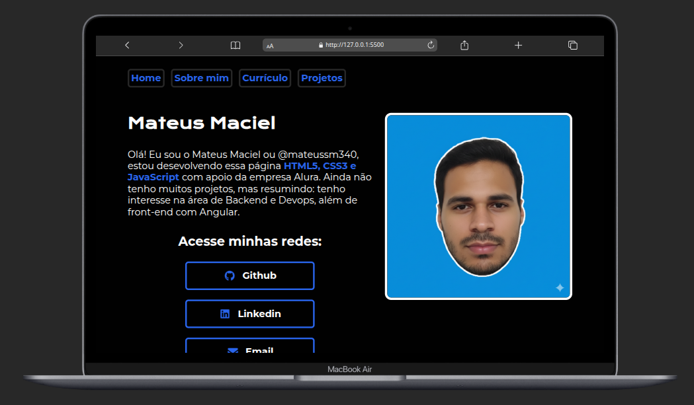
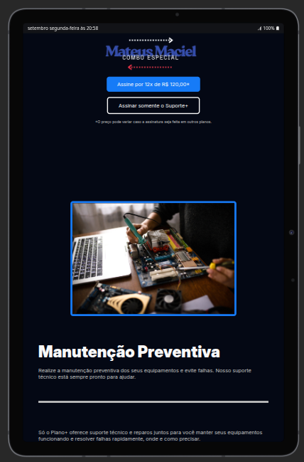
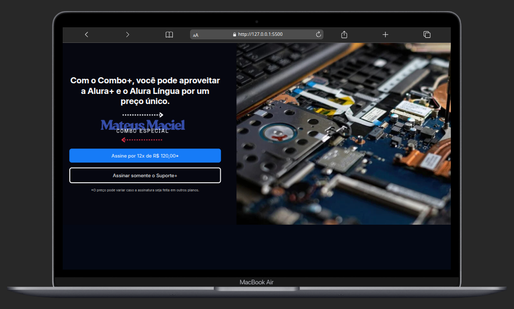
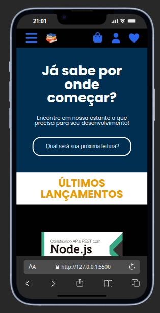
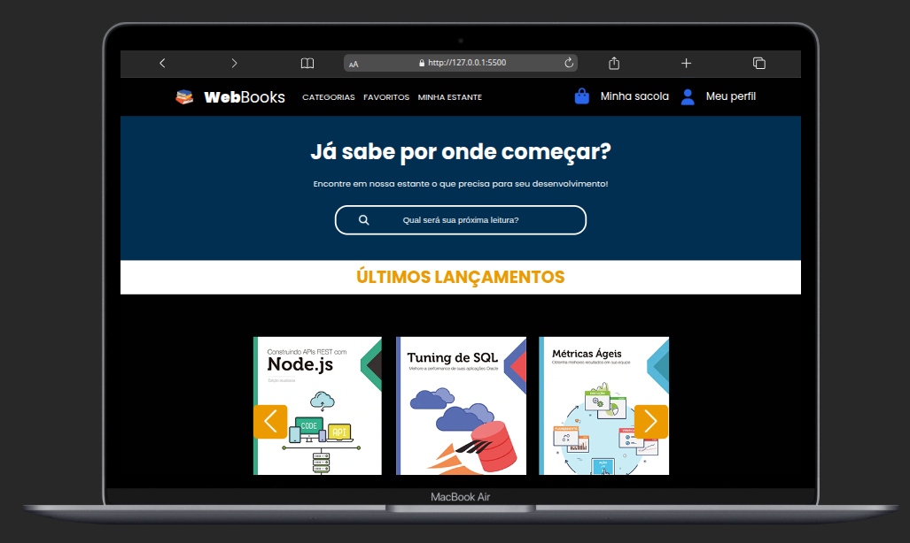

# Projects Web HTML5 e CSS (Flebox Layout)

## About

Project list:

- [x] Portfolio.
- [x] Technical Support.
- [x] Web Books.

[Deploy](https://projects-web-html5-css3.netlify.app/)

### Portfolio

|428px|1024px|1728px|
|------------|--------------|--------------------|
||||

### Technical Support

|428px|1024px|1728px|
|------------|--------------|--------------------|
||||

### Web Books

|428px|1024px|1728px|
|------------|--------------|--------------------|
||||

## Meta

### 1. From Scratch: HTML and CSS for Web Projects

- [x] HTML and CSS: development environments, file structure and tags.
- [x] HTML and CSS: Classes, Positioning, and Flexbox.
- [x] HTML and CSS: header, footer and CSS variables.
- [x] HTML and CSS: Working with Responsiveness and Publishing Projects.
- [x] HTML and CSS: practicing HTML/CSS.
- [x] HTML and CSS: Mobile-First Responsiveness.

## Contributors

Mateus Maciel, [@mateussm340](https://github.com/mateussm340)

## Licence

-x-.

> Sincerely, @mateussm340.